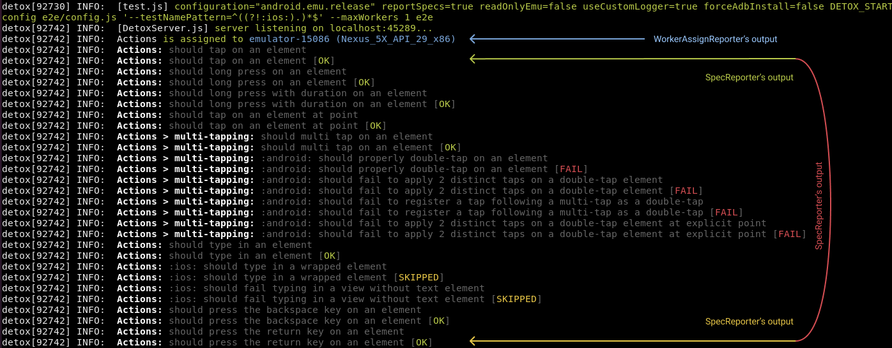

# Jest

## Disclaimer

- This guide describes installing Detox with Jest on a fresh project. If you're migrating an existing project, please apply some common sense in the process.

- The guide has been officially tested only with Jest 24.x.x. We cannot guarantee that everything would work with other versions.


## Installation

### 0. Set up Detox' fundamentals

Before starting out with Jest, please be sure to go over the fundamentals of the [Getting Started](Introduction.GettingStarted.md) guide.

### 1. Install Jest

```sh
npm install --save-dev jest
```

### 2. Set up test-code scaffolds

#### Run an automated init script:

```sh
detox init -r jest
```

> Errors occurring in the process may appear in red.

#### Fix & Verify

Even if `detox init` goes well and everything is green, we recommend going over some fundamental things, using our homebrewed [`demo-react-native-jest`](https://github.com/wix/Detox/tree/master/examples/demo-react-native-jest) example project as a reference.

##### a. Fix/verify this list of JSON properties:


| File                                                         | Property               | Value                                          | Description                                                  |
| ------------------------------------------------------------ | ---------------------- | ---------------------------------------------- | ------------------------------------------------------------ |
| [**`package.json`**](https://github.com/wix/Detox/blob/master/examples/demo-react-native-jest/package.json#L25) | `detox.test-runner`    | `"jest"`                                       | *Required.* Should be `"jest"` for the proper `detox test` CLI functioning. |
|                                                              | `detox.runner-config ` | (optional path to Jest config file)            | *Optional.* This field tells `detox test` CLI where to look for Jest's config file. If omitted, the path defaults to "e2e/config.json" (a file generated by `detox init -r jest`). |
| [**`e2e/config.json`**](https://github.com/wix/Detox/blob/master/examples/demo-react-native-jest/e2e/config.json) | `testEnvironment `     | `"node"`                                       | *Required*. Needed for the proper functioning of Jest and Detox. |
|                                                              | `setupFilesAfterEnv `  | `["./init.js"]`                                | *Required*. Indicates which files to run before each test suite. The field was [introduced in Jest 24](https://jestjs.io/docs/en/configuration#setupfilesafterenv-array). |
|                                                              | `reporters`            | ["detox/runners/<br/>jest/streamlineReporter"] | *Optional.* Available since  Detox `12.7.0`. Sets up our highly recommended `streamline-reporter` [Jest reporter](https://jestjs.io/docs/en/configuration#reporters-array-modulename-modulename-options), tailored for running end-to-end tests in Jest - which in itself was mostly intended for running unit tests. For more details, [see the migration guide](Guide.Migration.md#migrating-to-1270-from-older-nonbreaking). |
|                                                              | `verbose`              | `true`                                         | Must be `true` if you have replaced Jest's `default` reporter with Detox's `streamlineReporter`. Optional otherwise. |

A typical detox configuration in a `package.json`file:


##### b. Fix/verify the custom Jest init script (i.e. [`e2e/init.js`](https://github.com/wix/Detox/blob/master/examples/demo-react-native-jest/e2e/init.js)):

- `beforeAll()`, `beforeEach()`, `afterAll()` should be registered as hooks
  for invoking `detox` and/or a custom adapter.
- The custom Detox-Jest adapter must be registered as a `jasmine` reporter (`jasmine.getEnv().addReporter()`). It is required for the [artifacts subsystem](APIRef.Artifacts.md) to properly work.
- (Recommended) Starting Detox `12.7.0`, an additional, custom `spec-reporter` should be registered as a `jasmine` reporter, as well. This one takes care of logging on a per-spec basis (i.e. when `it`'s start and end) — which Jest does not do by default.
  Should be used in conjunction with the Detox-Jest adapter.

A typical Jest log output, having set up `streamline-reporter` in `config.json` and `spec-reporter` in `init.js`:




## Writing Tests

There are some things you should notice:

- Don't worry about mocks being used, Detox works on the compiled version of your app.
- Detox exposes it's primitives (`expect`, `device`, ...) globally, it will override Jest's global `expect` object.

## Parallel Test Execution

Through Detox' cli, Jest can be started with [multiple workers](Guide.ParallelTestExecution.md) that run tests simultaneously. In this mode, Jest effectively assigns one worker per each test file (invoking Jasmine over it). In this mode, the per-spec logging offered by the `spec-reporter` mentioned earlier, does not necessarily make sense, as the workers' outputs get mixed up.

By default, we disable `spec-reporter` in a multi-workers environment. If you wish to force-enable it nonetheless, the [`--jest-report-specs`](APIRef.DetoxCLI.md#test) CLI option can be used.

## How to run unit test and E2E tests in the same project

- If you have a setup file for the unit tests pass `./jest/setup` implementation into your unit setup.
- Call your E2E tests using `detox-cli`: `detox test`