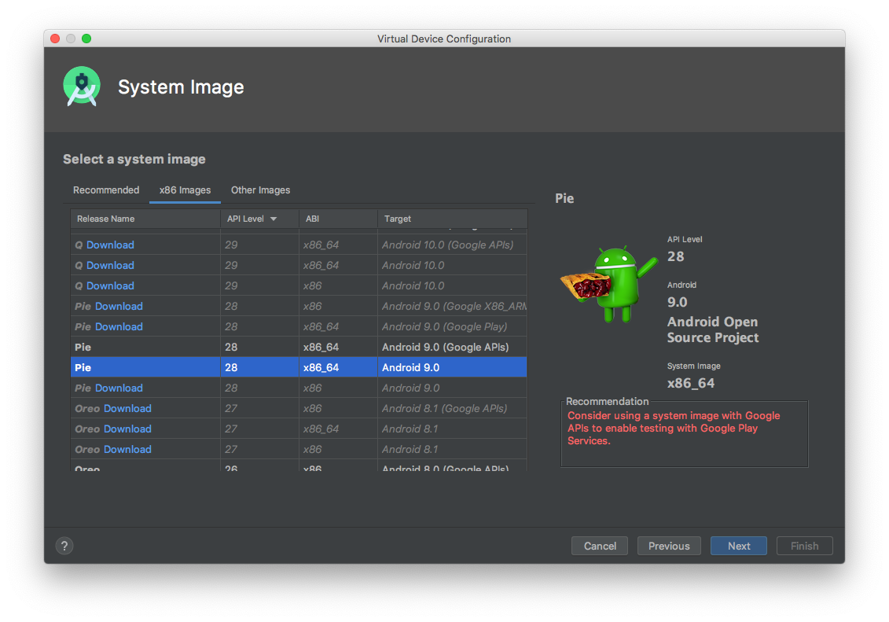

# Setting Up an Android Development and Testing Envrionment

This guide provides some core practices to follow in setting up a stable, reliable environment for running automated UI tests using Android emulators (using Detox, in particular) -- be it on a personal, _local_ computer, or a powerful CI machine.

It addresses mostly React Native developers - which are not necessarily familiar with all of Android's quirks, but also contains general recommendations regardless of the underlying dev-framework being used, as running automated UI test on Android is not the same as developing Android apps.

## Java Setup

This is the most fundamental step in the process, as without a proper Java SDK installed, nothing Android-ish works -- at least not from command-line, which is mandatory for executing `Detox`. For example, on a Mac with an improper Java version, we've come across cryptic errors such as this one when trying to launch Android's `sdkmanager`:

```
Exception in thread "main" java.lang.NoClassDefFoundError: javax/xml/bind/annotation/XmlSchema
	at com.android.repository.api.SchemaModule$SchemaModuleVersion.<init>(SchemaModule.java:156)
	at com.android.repository.api.SchemaModule.<init>(SchemaModule.java:75)
	at com.android.sdklib.repository.AndroidSdkHandler.<clinit>(AndroidSdkHandler.java:81)
	at com.android.sdklib.tool.sdkmanager.SdkManagerCli.main(SdkManagerCli.java:73)
	at com.android.sdklib.tool.sdkmanager.SdkManagerCli.main(SdkManagerCli.java:48)
Caused by: java.lang.ClassNotFoundException: javax.xml.bind.annotation.XmlSchema
	at java.base/jdk.internal.loader.BuiltinClassLoader.loadClass(BuiltinClassLoader.java:583)
	at java.base/jdk.internal.loader.ClassLoaders$AppClassLoader.loadClass(ClassLoaders.java:178)
	at java.base/java.lang.ClassLoader.loadClass(ClassLoader.java:521)
	... 5 more
```

While the stacktrace might seem intriguing for some, what matters here is the solution: **Android needs Java 1.8 installed**.

On MacOS, in particular, java comes from both the OS _and_ possibly other installers such as `homebrew`, so you are more likely to go into a mess: see [this Stackoverflow post](https://stackoverflow.com/questions/24342886/how-to-install-java-8-on-mac).

To check for your real java-executable's version, in a command-line console, run:

```
java -version
```

What needs to be verified is that `java` is in-path and that the output contains something as this:

```
java version "1.8.0_121"
...
```

Namely, that the version is `1.8.x_abc`.

> Note: Do not be confused by the Java version potentially used by your browsers, etc. For `Detox`, what the command-line sees is what matters.

---

If `java` isn't in your path (i.e. the command failed altogher), try installing it using [this guide](https://www.java.com/en/download/help/path.xml).

If otherwise the version is simply wrong, try these refs for Macs; consider employing the `JAVA_HOME` variable to get this to work right:

* https://java.com/en/download/faq/java_mac.xml#version
* https://www.java.com/en/download/help/version_manual.xml
* https://medium.com/notes-for-geeks/java-home-and-java-home-on-macos-f246cab643bd

## Android AOSP Emulators

We've long proven that for automation - which requires a stable and deterministic environment, Google's emulators running with Google API's simply don't deliver what it takes. Be it the preinstalled Google play-services - which tend to take up a lot of CPU, or even Google's `gboard` Keyboard - which is full-featured but overly bloated: These encourage flakiness in tests, which we are desperate to avoid in automation.

Fortunately, the Android team at Google offers a pretty decent alternative: **AOSP emulators** (Android Open-Source Project). While possibly lacking some of the extended Google services, and a bit less fancy overall, **we strongly recommend** to strictly use this flavor of emulators for running automation/Detox tests. They can be installed alongside regular emulators.

*Here's a visual comparison between the two - an SDK 28 (Android 9) AOSP emulator (left) vs. an emulator with Google API's installed (right):*


#### Here's how to install them using the command line:

While it's possible to do this using Android Studio, we'll focus on the command line, as it also good for _headless_ CI machines.

1. Locate your 'Android home' folder - typically set in the `ANDROID_HOME` environment variable on linux and mac machines, or in it's successor - `ANDROID_SDK_ROOT`. If `ANDROID_HOME` isn't set, either set it yourself or run the following commands after `cd`-ing into the home folder.
2. Install the Google-API's-less emulator-image:

```shell
$ANDROID_HOME/tools/bin/sdkmanager "system-images;android-28;default;x86_64"
$ANDROID_HOME/tools/bin/sdkmanager --licenses
```

> * With `;android-28;`, we assumed SDK 28 here, but other API's are supported just the same.
> * The `;default;` part replaces `;google_apis;`, which is the default, and is what matters here.

3. Create an emulator (i.e. AVD - Android Virtual Device):

```shell
$ANDROID_HOME/tools/bin/avdmanager create avd -n Pixel_API_28_AOSP -d pixel --package "system-images;android-28;default;x86_64"
```

> * `Pixel_API_28_AOSP` is just a suggestion for a name. Any name can work here, even `Pixel_API_28` - but you might have to delete an existing non-AOSP emulator, first. In any case, the name used in Detox configuration (typically in `package.json`) should be identical to this one.
> * `-d pixel` will install an emulator with the specs of a Pixel-1 device. Other specs can be used.
> * `--package` is the most important argument: be sure to use the same value as you did in part 2, above, with `;default;`.
>
> Run `avdmanager create --help` for the full list of options.

4. Launch the emulator:

This isn't mandatory, of course, but it's always good to launch the emulator at least once before running automated tests. The section below will discuss optimizing emulators bootstraping.

At this point, you should be able to launch the emulator from Android Studio, but that can also be done from a command-line console. Assuming the new emulator's name is `Pixel_API_28_AOSP`, execute this:

```shell
$ANDROID_HOME/emulator/emulator -verbose @Pixel_API_28_AOSP &
```

Or, if you're aiming, for example, at running a verbose, headless emulator on a UI-less Linux system (e.g. a CI machine):

```shell
$ANDROID_HOME/emulator/emulator -verbose -no-window -no-audio -gpu swiftshader_indirect @Pixel_API_28_AOSP &
```

> See [this guide](https://developer.android.com/studio/run/emulator-commandline) for full details on the `emulator` executable.

#### Installing from Android Studio

We won't go into all the details but once the proper image is installed with the `sdkmanager`, the option becomes available in the AVD creation dialog - see `Target` column of the selected image:



## Emulator snapshots

todo

