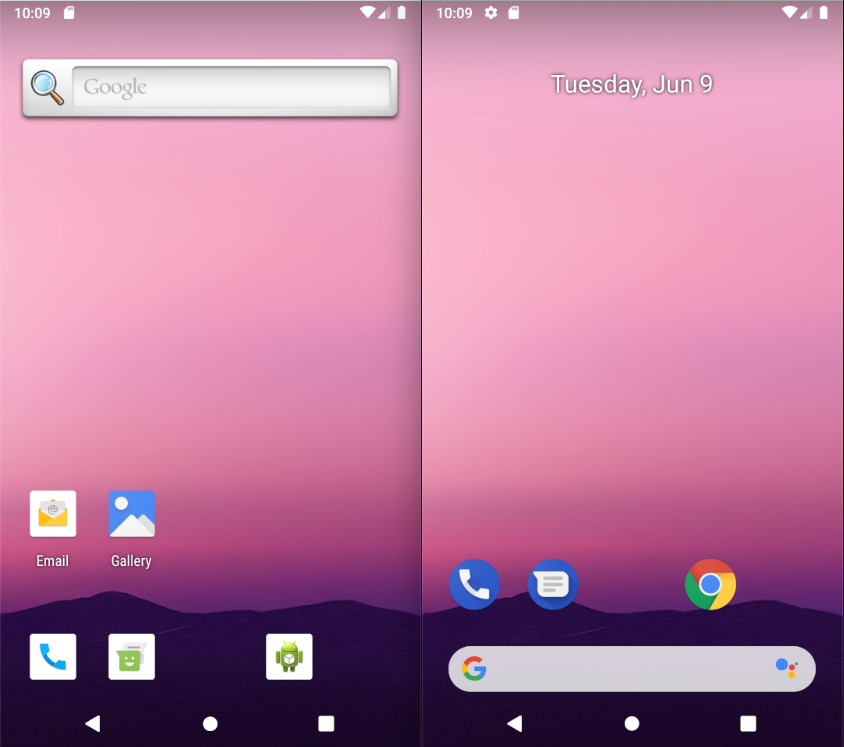
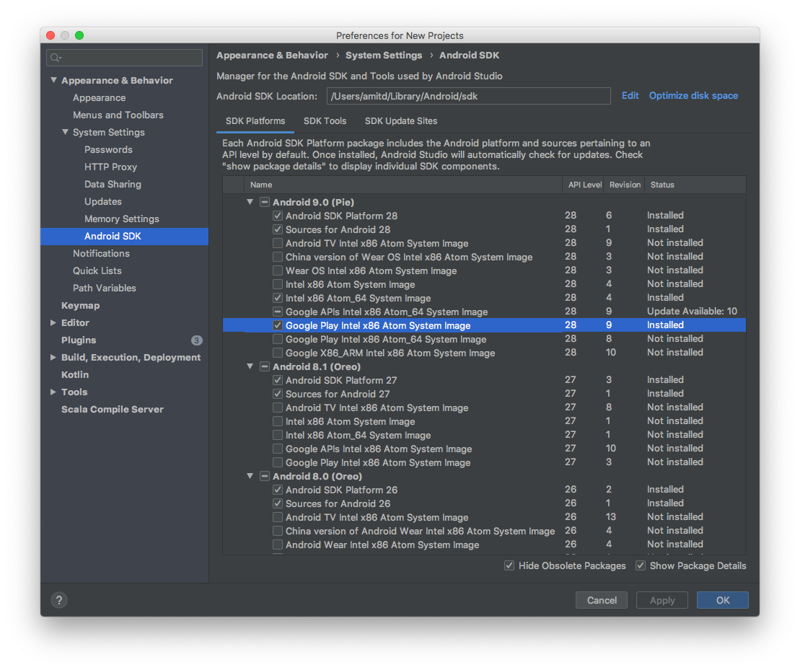

# Setting Up an Android Development and Testing Envrionment

This guide provides some core practices to follow in setting up a stable, reliable environment for running automated UI tests using Android emulators (using Detox, in particular) -- be it on a personal, _local_ computer, or a powerful CI machine.

It addresses mostly React Native developers - which are not necessarily familiar with all of Android's quirks, but also contains general recommendations regardless of the underlying dev-framework being used, as running automated UI test on Android is not the same as developing Android apps.

## Java Setup

This is the most fundamental step in the process, as without a proper Java SDK installed, nothing Android-ish works -- at least not from command-line, which is mandatory for executing `Detox`. For example, on a Mac with an improper Java version, we've come across cryptic errors such as this one when trying to launch Android's `sdkmanager`:

```
Exception in thread "main" java.lang.NoClassDefFoundError: javax/xml/bind/annotation/XmlSchema
	at com.android.repository.api.SchemaModule$SchemaModuleVersion.<init>(SchemaModule.java:156)
	at com.android.repository.api.SchemaModule.<init>(SchemaModule.java:75)
	at com.android.sdklib.repository.AndroidSdkHandler.<clinit>(AndroidSdkHandler.java:81)
	at com.android.sdklib.tool.sdkmanager.SdkManagerCli.main(SdkManagerCli.java:73)
	at com.android.sdklib.tool.sdkmanager.SdkManagerCli.main(SdkManagerCli.java:48)
Caused by: java.lang.ClassNotFoundException: javax.xml.bind.annotation.XmlSchema
	at java.base/jdk.internal.loader.BuiltinClassLoader.loadClass(BuiltinClassLoader.java:583)
	at java.base/jdk.internal.loader.ClassLoaders$AppClassLoader.loadClass(ClassLoaders.java:178)
	at java.base/java.lang.ClassLoader.loadClass(ClassLoader.java:521)
	... 5 more
```

While the stacktrace might seem intriguing for some, what matters here is the solution: **Android needs Java 1.8 installed**.

On MacOS, in particular, java comes from both the OS _and_ possibly other installers such as `homebrew`, so you are more likely to go into a mess: see [this Stackoverflow post](https://stackoverflow.com/questions/24342886/how-to-install-java-8-on-mac).

To check for your real java-executable's version, in a command-line console, run:

```
java -version
```

What needs to be verified is that `java` is in-path and that the output contains something as this:

```
java version "1.8.0_121"
...
```

Namely, that the version is `1.8.x_abc`.

> Note: Do not be confused by the Java version potentially used by your browsers, etc. For `Detox`, what the command-line sees is what matters.

---

If `java` isn't in your path or not even installed (i.e. the command failed altogher), try [this guide](https://www.java.com/en/download/help/path.xml).

If otherwise the version is simply wrong, try these refs for Macs; consider employing the `JAVA_HOME` variable to get things to work right:

* https://java.com/en/download/faq/java_mac.xml#version
* https://www.java.com/en/download/help/version_manual.xml
* https://medium.com/notes-for-geeks/java-home-and-java-home-on-macos-f246cab643bd

## Android AOSP Emulators

We've long proven that for automation - which requires a stable and deterministic environment, Google's emulators running with Google API's simply don't deliver what it takes. Be it the preinstalled Google play-services - which tend to take up a lot of CPU, or even Google's `gboard` Keyboard - which is full-featured but overly bloated: These encourage flakiness in tests, which we are desperate to avoid in automation.

Fortunately, the Android team at Google offers a pretty decent alternative: **AOSP emulators** (Android Open-Source Project). While possibly lacking some of the extended Google services, and a bit less fancy overall, **we strongly recommend** to strictly use this flavor of emulators for running automation/Detox tests. They can be installed alongside regular emulators.

*Here's a visual comparison between the two - an SDK 28 (Android 9) AOSP emulator (left) vs. an emulator with Google API's installed (right):*



#### Here's how to install them using the command line:

While it's possible to do this using Android Studio, we'll focus on the command line, as it also good for _headless_ CI machines.

1. Locate your 'Android home' folder - typically set in the `ANDROID_HOME` environment variable on linux and mac machines, or in it's successor - `ANDROID_SDK_ROOT`. If `ANDROID_HOME` isn't set, either set it yourself or run the following commands after `cd`-ing into the home folder.
2. Install the Google-API's-less emulator-image:

```shell
$ANDROID_HOME/tools/bin/sdkmanager "system-images;android-28;default;x86_64"
$ANDROID_HOME/tools/bin/sdkmanager --licenses
```

> * With `;android-28;`, we assumed SDK 28 here, but other API's are supported just the same.
> * The `;default;` part replaces `;google_apis;`, which is the default, and is what matters here.

3. Create an emulator (i.e. AVD - Android Virtual Device):

```shell
$ANDROID_HOME/tools/bin/avdmanager create avd -n Pixel_API_28_AOSP -d pixel --package "system-images;android-28;default;x86_64"
```

> * `Pixel_API_28_AOSP` is just a suggestion for a name. Any name can work here, even `Pixel_API_28` - but you might have to delete an existing non-AOSP emulator, first. In any case, the name used in Detox configuration (typically in `package.json`) should be identical to this one.
> * `-d pixel` will install an emulator with the specs of a Pixel-1 device. Other specs can be used.
> * `--package` is the most important argument: be sure to use the same value as you did in part 2, above, with `;default;`.
>
> Run `avdmanager create --help` for the full list of options.

4. Launch the emulator:

This isn't mandatory, of course, but it's always good to launch the emulator at least once before running automated tests. The section below will discuss optimizing emulators bootstraping.

At this point, you should be able to launch the emulator from Android Studio, but that can also be done from a command line console, as explained in the [cheetsheet below](#locating-the-avds-home-directory).

> See [this guide](https://developer.android.com/studio/run/emulator-commandline) for full details on the `emulator` executable.

#### Installing from Android Studio

We won't go into all the details but once the proper image is installed using the `sdkmanager`, the option becomes available in the AVD creation dialog  (see `Target` column of the Virtual Device Configuration screen below):




## Emulator Quick-Boot

If the system allows saving a state (for example, in personal computers or a CI system that can start from prebaked images you can configure), we highly and strongly recommend setting up quick-boot snapshots for any emulator that is used for testing automation.

Quick-boot saves significant time otherwise wasted when emulators cold-boot from scratch. The concept becomes more prominent in environments capable of parallel-executing tests in multiple, concurrently running emulators (as when [Detox is run with multiple Jest workers](Guide.Jest.md)).

This is something that we actually recommend applying in the emulator itself rather than using command-line, but we'll include both options.

In any case, the general principle we're going to instruct is as follows:

1. Enable auto-save for an installed / running emulator.
2. Launch it, and, when stable, terminate -- a snapshot is saved as a result.
3. Disable auto-save, so that future, test-tainted snapshots won't be saved. 

#### Setting up a quick-boot snapshot from the Emulator

Start by launching a freshly baked emulator. Wait for it to go stable.

When running, go to settings (3 dots in the sidebar) > `Snapshots` > `Settings` tab. If not already set, select `Yes` in the `auto-save` option. This should prompt for a restart -- choose `Yes`. The emulator should restart **and save a snapshot.**


Do this again after the emulator is back up, but set `No` in the `auto-save` option. Allow it to restart yet again: it will immediately boot into the state saved as a snapshot earlier.

You can also try these as alternative sources for this:

* [Snapshots in Google devs page](https://developer.android.com/studio/run/emulator#snapshots) for full details on snapshots.
* [Highly detailed blogpost](https://devblogs.microsoft.com/xamarin/android-emulator-quick-boot/)

#### Setting up a quick-boot snapshot from command-line

This is a bit more difficult, but is also applicable even for UI-less machines.

1. [Locate the AVD's `config.ini`](#locating-the-avds-home-directory)
2. Using your favorite text editor, either change or add these key-value sets:

```ini
fastboot.chosenSnapshotFile=
fastboot.forceChosenSnapshotBoot=no
fastboot.forceColdBoot=no
fastboot.forceFastBoot=yes
```

> Empirically, `forceFastBoot=yes` and `forceColdBoot=no` should be enough.

3. Under the AVD's home directory, either create or edit yet another `ini` file called `quickbootChoice.ini` with the following content:

```ini
saveOnExit = true
```

4. Now that everything is in place, [launch your emulator](#booting-an-emulator-via-command-line) once (in verbose mode) and wait for it to fully load. Then, shut it down, and make sure the [state has been saved](#verifying-the-emulators-quick-boot-snapshot-has-been-saved). 
5. Last but not least, go back to `quickbootChoice.ini` and now switch to:

```ini
saveOnExit = false
```

#### Disclaimer

After upgrading the emulator's binary to a newer version, it usually consider all existing snapshots invalid.

This can be addressed by either recreating the AVD's altogher, or just deleting and creating the snapshots as explained.

## Cheatsheet

### Locating the AVD's home directory

Each AVD generated by the Android tools gets it's own directory where associated content is stored:

* **Configuration file (i.e. `config.ini`)**
* Snapshot images
* SD-card content

to name a few.

On Mac machines, the AVD directory typically maps to:

```
$HOME/.android/avd/<AVD Name>.avd/
```

_(for example: `/Users/root/.android/avd/Pixel_API_28_AOSP.avd/`)_

The path should be similar on Linux machines, even though `$HOME` isn't `/Users/root` but typically `/home/root` *(for example: `/home/root/.android/avd/Pixel_API_28_AOSP.avd/`).*

### Booting an emulator via command-line

> * The following examples apply for both Mac and Linux, and should be similar on Windows.
> * They assume the emulator's name is `Pixel_API_28_AOSP`. If it isn't, adjust the names accordingly:

**Shortcut for booting a verbose, visible emulator in a GUI supporting system**

```shell
$ANDROID_HOME/emulator/emulator -verbose @Pixel_API_28_AOSP &
```

**Shortcut for booting a verbose, _headless_ emulator in a UI-less Linux system**

```shell
$ANDROID_HOME/emulator/emulator -verbose -no-window -no-audio -gpu swiftshader_indirect @Pixel_API_28_AOSP &
```

### Verifying the emulator's quick-boot snapshot has been saved

If you've run your emulator in verbose mode from a shell, it's easy to verify the state has been saved by following the logs. In particular, when shutting the emulator down, this log asserts the state has been saved:

```
emulator: Saving state on exit with session uptime 9423 ms
```

> as a reference, when the state is _not_ saved, the typical output is:
>
> ```
> emulator: WARNING: Not saving state: RAM not mapped as shared
> ```
>
> It can be a result of an improper configuration, or an emulator launch where the `-read-only` argument was provided.